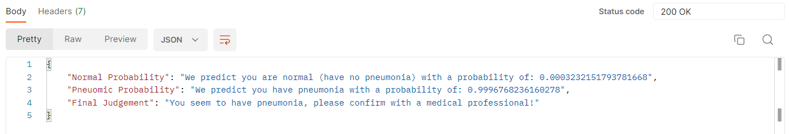

# PulmoLens 🫁

PulmoLens is a deep learning model that uses AWS SageMaker and associated tools to detect pneumonia in X-ray images. The project leverages the power of machine learning fundamentals to create an accurate model (validation accuracy of 85%), which has been extensively tested using PostMan-API to confirm its efficacy. The model has been deployed using a serverless architecture, which includes AWS Lambda, API Gateway, S3, IAM, and CloudWatch. The model's endpoint is currently not active to avoid incurring unnecessary costs. To use the model, you will need to deploy it yourself (instructions will be provided below soon).

## Overview 👀

PulmoLens is a project that uses deep learning to detect pneumonia in X-ray images. The project uses AWS SageMaker and associated tools such as Lambda, API-Gateway, S3, IAM, and CloudWatch. The model has been trained using machine learning fundamentals to provide highly accurate results.

**Check out the video of the project in action [here](https://github.com/akkik04/PulmoLens/blob/main/assets/PulmoLens-InAction.mp4) (click 'view raw' to access video)**

## Features 📋 

* Deep learning model for pneumonia detection
* Uses AWS SageMaker and associated tools for implementation
* Extensively tested using PostMan-API
* Highly accurate results for a first-timer (validation accuracy of 85% & train accuracy of 94%)

## Architecture 🏗

PulmoLens uses a serverless architecture to deploy the deep learning model. The architecture includes:

* AWS SageMaker for training the model
* AWS Lambda for serverless computing
* API Gateway for deploying the model as a REST API
* S3 for storing and retrieving the model artifacts
* IAM for access control
* CloudWatch for monitoring and logging

## Usage 📚

Once the model is deployed, you can use it to detect pneumonia in X-ray images. To use the model, send a POST request to the API endpoint with the X-ray image in the request body. The model will return a response indicating whether the image contains pneumonia or not.

* Below is a sample request sent with an X-ray image of a patient with pneumonia on PostMan-API:

**Check out the video of the project in action [here](https://github.com/akkik04/PulmoLens/blob/main/assets/PulmoLens-InAction.mp4)**

**Note**: The model's endpoint is currently not active to avoid incurring unnecessary costs. To use the model, you will need to deploy it yourself. The AWS endpoint link is not fully visible in the project-video, for security reasons. Please contact me if you would like to see the full link.
